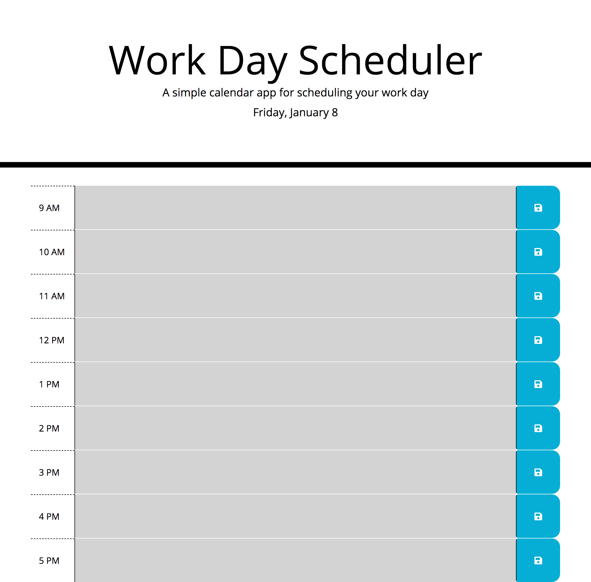

# work-day-scheduler

## Purpose
A website that allows you to add important events to an online daily planner for efficient time management. It is color coded for past, present, and future hours. 

## Built With 
HTML, CSS (bootstrap), and JavaScript (jquery & moment)

## Website
https://emilykidd3.github.io/work-day-scheduler/

## Screenshot

